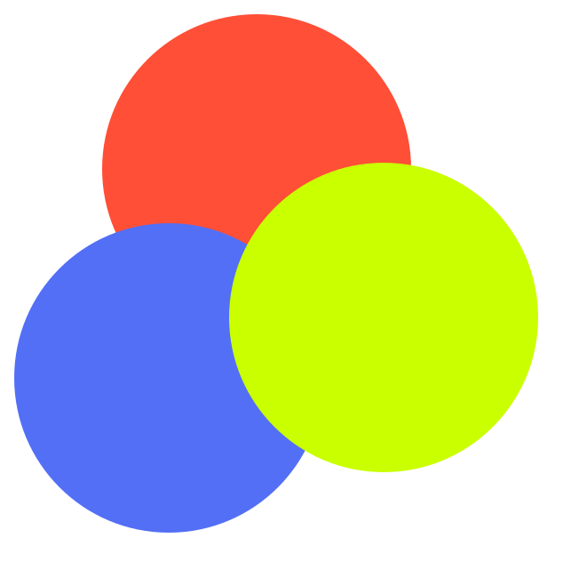

  

<h1 align="center">IROLOGIC.</h1>

一个通过观察与作答，理解光色与颜料混色关系的互动色彩练习。

  <a href="./README.md">English</a>

  <a href="#功能">功能</a> ·
  <a href="#色彩规则">色彩规则</a> ·
  <a href="#贡献">贡献</a>

---

IROLOGIC 把基础色彩理论变成简洁的交互练习。每次进入页面，应用会随机生成一道关于加色法或减色法的题目；选择答案后，六角色彩盘会以动画展示配方与结果，帮助你将「颜色名称」和「颜色关系」建立直觉联系。

## 名称由来

**IROLOGIC** 由 **IRO** 与 **LOGIC** 组成：`IRO`（いろ）是日语中的“色”，`LOGIC` 意为逻辑。它表达了项目的核心——不只记住颜色混合的结论，更通过观察、选择与反馈，理解颜色之间的规律。

## 功能

### 互动练习

- 随机出题：在光色与颜料配方中随机生成题目。
- 双向提问：既可以判断混合后的结果，也可以反推得到目标颜色所需的颜色。
- 即时反馈：完成选择后立即标注正确与错误答案，并给出简明说明。
- 连续练习：一题完成后可直接进入下一题。

### 可视化学习

- 六角色彩盘：固定展示红、黄、绿、青、蓝、品红的位置关系。
- 配方动画：作答后以连线、光晕和文字动态揭示正确配方。
- 光色与颜料：覆盖 RGB 加色混合与 CMY 减色混合的基础规则。
- 减少动态支持：遵循系统的“减少动态效果”偏好，降低动画强度。

## 色彩规则

| 系统 | 配方 | 结果 |
| --- | --- | --- |
| 光色（加色法） | 红 + 绿 | 黄 |
| 光色（加色法） | 绿 + 蓝 | 青 |
| 光色（加色法） | 红 + 蓝 | 品红 |
| 颜料（减色法） | 黄 + 青 | 绿 |
| 颜料（减色法） | 青 + 品红 | 蓝 |
| 颜料（减色法） | 品红 + 黄 | 红 |

## 贡献

欢迎提交改进建议与代码贡献。

1. Fork 本仓库。
2. 新建分支：`git checkout -b feature/your-feature`。
3. 完成修改，并运行 `pnpm test:run` 与 `pnpm typecheck`。
4. 提交修改并发起 Pull Request。

## 许可证

本项目采用 [MIT License](./LICENSE) 发布。

---

如果这个小练习对你有帮助，欢迎给仓库点一个 Star。
